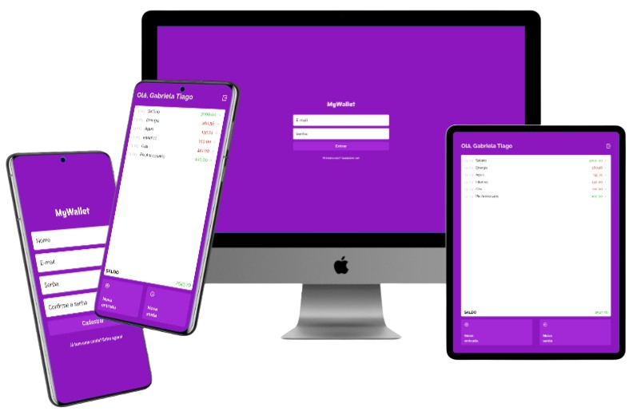

<p align="center"></p>

# <p align="center">MyWallet</p>

#### <p align="center">Aplicação para registro financeiro</p>

<p align="center">
   

   

   

   

   
</p>

<center>



</center>

$~$

---

### :clipboard: Descrição

O projeto "MyWallet" é uma ferramenta que permite aos usuários gerenciarem suas finanças pessoais de forma descomplicada e eficiente. Com esta aplicação, os usuários podem registrar suas despesas e receitas e visualizar facilmente seu saldo monetário atual.

Neste web app, os usuários podem registrar seus gastos diários, como compras em supermercados, pagamentos de contas, gastos com lazer, etc. Eles também podem registrar suas receitas, como salários, rendas extras, entre outros. Facilitando assim, o controle financeiro pessoal, mantendo em apenas um local todas as suas transações financeiras, visando a praticidade para um melhor planejamento financeiro.

#### 💰 [Acesse aqui](https://mywallet-gabrielatiago.vercel.app/)

---

### :rocket: Rodando o projeto localmente

Este projeto foi iniciado com [Create React App](https://github.com/facebook/create-react-app), portanto, certifique-se de ter a última versão estável do [Node.js](https://nodejs.org/en/download) e [npm](https://www.npmjs.com/) rodando localmente.

Primeiro de tudo, inicialize o servidor backend, para isso siga as instruções do [link](https://github.com/GabrielaTiago/MyWallet-back).

Realizar o clone deste projeto, no terminal de sua máquina, utilize o [git](https://git-scm.com/) e insira o seguinte comando:

```bash
    git clone git@github.com:GabrielaTiago/MyWalllet-front.git
```

Entre na pasta do projeto

```bash
    cd MyWalllet-front
```

Execute o seguinte comando para instalar as dependências.

```bash
    npm install
```

Na raiz do projeto, adicione um arquivo **.env** com a seguinte informação

```bash
    REACT_APP_BASE_URL=http://localhost:5000
```

Depois de instalar as dependências, execute o comando para iniciar a aplicação.

```bash
    npm run start
```

A aplicação será iniciada em "http://localhost:3000" no seu navegador.

---

### 🎮 Usando

<https://user-images.githubusercontent.com/77814822/224880264-941af7d0-eef9-4932-8b2d-58d387915806.mp4>

---

### :bulb: Reconhecimentos

- [Badges para Github](https://github.com/alexandresanlim/Badges4-README.md-Profile#-database-)
- [README Inspiração de README](https://gist.github.com/luanalessa/7f98467a5ed62d00dcbde67d4556a1e4#file-readme-md)
- [Driven Education](https://www.driven.com.br)

---

### 👩‍🦱 Autora

Gabriela Tiago de Araújo

- email: gabrielatiagodearaujo@outlook.com
- linkedin: <https://www.linkedin.com/in/gabrielatiago/>
- portfolio: <https://gabrielatiago.vercel.app>

$~$

[🔝 De volta ao topo](#mywallet)
